# GEMM to SoL

GEMM (General Matrix Multiply) to SoL (Speed of Light) are a collection of matrix multiplication kernels that build up optimizations upon each other to get as close as possible to the theoretical speed limit of matrix multiplication on gpus, the "speed of light." This project will be targeting SGEMM (fp32 GEMM) on a T4 gpu because it will help to build a strong foundation before moving on to modern features. The end result should be a kernel that is compute bound.

## Naive Implementation

The most basic GEMM implementation is three nested for loops:

```C++
for(int m = 0; m < M; m++) {     // } these loops get parallelized in the kernel
    for(int n = 0; n < N; n++) { // }
        for(int k = 0; k < K; k++) {
            C[m][n] += A[m][k] * B[k][n];
        }
    }
}
```

Using input matrices A (dims: M,K) and B (dims: K,N) we can create an output matrix C (dims: M,N) where each C output element (m,n) we compute the dot product along the shared k dimension of matrices A and B.

<div align="center">
    <br>
    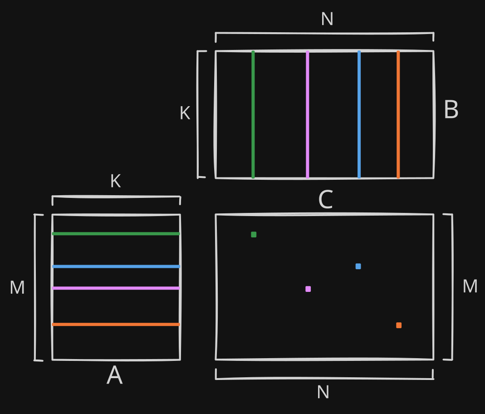
    <br>
    <br>

</div>

To find the colored output element in the C matrix, we have to compute the dot product between the matching vectors from the A and B matrices. M, N, and K can be any size.

### Naive kernel implementation:

```C++
__global__ void gemm_naive_kernel(const float* A, const float* B, float* C, int M, int N, int K) {
    int tid = blockIdx.x * blockDim.x + threadIdx.x; // global thread id

    if (tid >= M * N) { // boundary check
        return;
    }

    // For a row major matrix which is size MxN, element (row, col) is at
    // a true array index of: row * N + col. The end result is an array in
    // which the rows of the matrix are laid out one after another. 
    // In this array, to move up to the next col idx we add 1 and to 
    // move to the next row idx we add N.
    // 
    // We have to do this because we need the row and col indices separately for 
    // accessing the correct elements in the A & B input matrices.
    // To do the opposite conversion using / and % with the row width (N)
    // to create row and col indices.
    int m = tid / N; // row 
    int n = tid % N; // col
    
    float accum = 0;
    for (int k = 0; k < K; k++) {
        // compute dot product by iterating along k
        accum += A[m * K + k] * B[k * N + n]; 
    }
    // write back result
    C[tid] = accum; // equivalent to C[m * N + n] 
}
```

In our naive implementation kernel we parallelize the outer two loops iterating over the M and N dimensions. This means that we have one working thread computing the entire dot product for one output element. If we were to also parallelize the K dimension it would be called a split-k GEMM. Typically we avoid split-k GEMM unless we have a large K dimension because we would have to combine outputs across threads which creates unnecessary complexity and overhead.

We also have a thread local sum variable which keeps the sum in a register until the computation is finished rather than writing to global memory (GMEM) each iteration.

### Kernel Launch Code:

```C++
torch::Tensor gemm_naive(torch::Tensor A, torch::Tensor B) {
    auto t = prep_tensors(A, B); // creates output tensor, checks dtype, contiguity, gets pointers, and gets M, N, K

    dim3 block(16, 16);
    dim3 grid((t.M + block.x - 1) / block.x, (t.N + block.y - 1) / block.y); // (a + b - 1) / b is the ceiling division operation where instead of having a remainder, we round up to the nearest multiple of b

    gemm_naive_kernel<<<grid, block>>>(t.A, t.B, t.C, t.M, t.N, t.K);
    cudaDeviceSynchronize();
    
    return t.C_tensor;

}
```

This our Kernel Launch code, it won't change much throughout the series. The main things to note are that we have chosen to have thread blocks that are 16x16 (256) threads large and that we are doing ceiling division so that we pad with extra threads in case our matrices have a dimension that is not divisible by block size. It is important that we keep our parameters either powers of 2 or multiples of high powers of 2 even if it means having wasted threads because a lot of the hardware parameters are also powers of 2 and having hardware alignment boosts performance.

% NAIVE SPEED HERE %

## Anatomy of a GPU
Before we get into optimizing, we need to develop an understanding of the hardware that we are optimizing. In our case this is an NVIDIA Tesla T4 gpu. Starting from our largest supply of on-gpu memory we have DRAM. DRAM holds the global memory (GMEM) address space where most of our data is stored. This large size requires a tradeoff: GMEM accesses are slow, with relatively low throughput %%(300 GB/s) and high latency %%(300+ clock cycles).

<div align="center">
    
    <br>
</div>
<sup>
This card is a Tesla P4 instead of a T4 
</sup>
<sub>

Source: [[1] NVIDIA Dev Forums](https://forums.developer.nvidia.com/t/tesla-p4/253537)

</sub>
&nbsp;

On the T4, each DRAM chip is assigned to its own memory controller on the left and right edges of the main chip. The memory controller handles in DRAM load/store requests from the L2 cache.


<div align="center">
    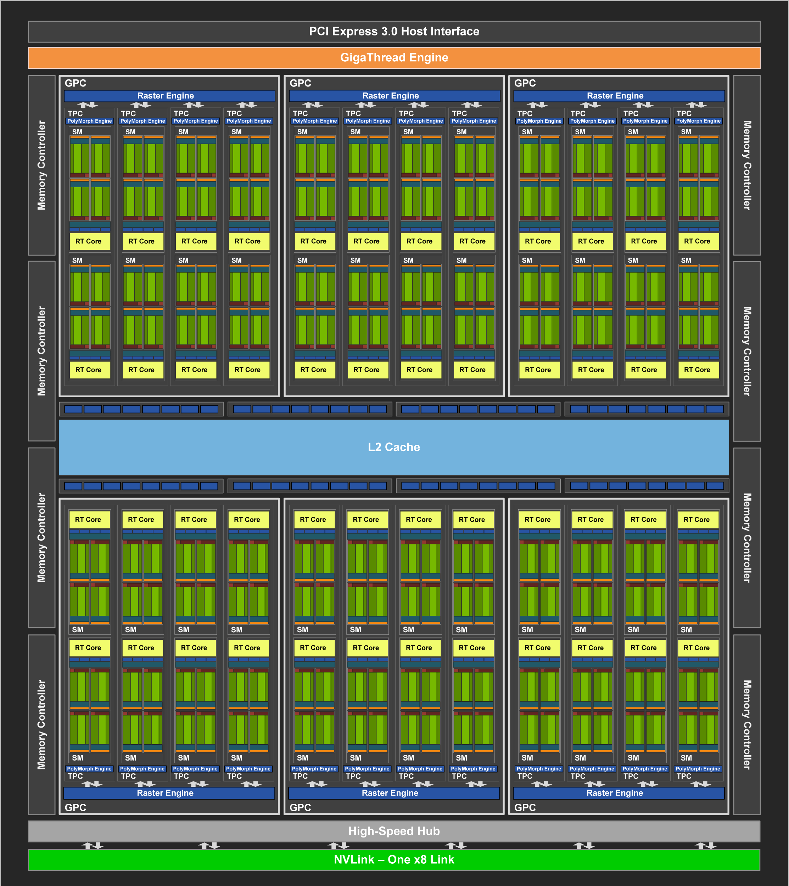
    <br>
</div>
<sup>
A diagram of a TU104 die used in a T4
</sup>

<sub>

Source: [[2] NVIDIA Turing Architecture Whitepaper ](https://www.nvidia.com/content/dam/en-zz/Solutions/design-visualization/technologies/turing-architecture/NVIDIA-Turing-Architecture-Whitepaper.pdf)

</sub>
The L2 cache is the lowest level cache on the GPU memory hierarchy. It's responsible for speeding up redundant accesses to DRAM. Hitting the L2 cache takes us from DRAM's 300+ cycles latency<sup><a href="https://arxiv.org/pdf/1903.07486">[3]</a></sup> and 220 GiB/s bandwidth<sup><a href="https://www.nvidia.com/content/dam/en-zz/Solutions/Data-Center/tesla-t4/t4-tensor-core-datasheet-951643.pdf">[4]</a></sup> to L2's 188 cycles latency<sup><a href="https://arxiv.org/pdf/1903.07486">[3]</a></sup> and 1.18 TiB/s bandwdith<sup><a href="https://arxiv.org/pdf/1903.07486">[3]</a></sup>. GPCs, TPCs, Raster Engines, PolyMorph Engines can all be ignored as they wont be relevant for our use case. 

&nbsp;

Moving onto the SMs, SMs or Streaming Multiprocessors are the most basic self-contained execution units of a GPU. They can be thought of as the GPU analog for CPU cores. The SMs are responsible for executing entire thread blocks. The T4 has 40 of the TU104's 48 SMs enabled (8 are binned).

<div align="center">
    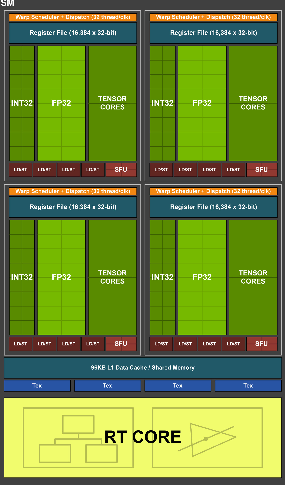
    <br>
</div>
<sup>
A single TU104 SM
</sup>

<sub>

Source: [[2] NVIDIA Turing Architecture Whitepaper ](https://www.nvidia.com/content/dam/en-zz/Solutions/design-visualization/technologies/turing-architecture/NVIDIA-Turing-Architecture-Whitepaper.pdf)

</sub>

Located at the bottom of the TU104 SM, the next level up on the memory hierarchy is Shared Memory (SMEM) and L1 cache. In the T4, SMEM and L1 share a 96 KiB allocation that can be split into 64 KiB & 32 KiB biased to either L1 or SMEM. The L1 cache is the highest level data cache in the GPU. If the result of GMEM read/write request is not in the L1 cache the request is passed to the L2 cache. It has a 32 cycle hit latency and 3,484 GiB/s aggregate bandwidth (87.1 GiB/s per SM). SMEM is a programmer managed memory local to each SM. SMEM is shared by within a block residing on an SM. Due to SMEM not having to deal with the overhead of caching, Its slightly faster with a latency of 19 cycles and an aggregate throughput of 3,662 GiB/s (91.6 GiB/s per SM).

Each SM is partitioned into 4 identical sections. At the top each section, we have the highest level of the memory hierarchy: the register file. The register file is responsible for holding each thread's "scratchpad." Before a thread runs an instruction, the operands must be in the thread's register allocation*. Below the register file we have the compute units: INT32 and FP32 house ALUs for their respective dtypes; Tensor cores do small matmuls in FP16, INT8, INT4, or INT1; LD/STs generate load/store requests; and SFUs handle special functions like exp, reciprocal, sqrt, trig functions, etc. Finally, at the top of a partition, we have the warp scheduler responsible for issuing instructions and managing concurrency within its partition.

<sup>*post-Hopper GPU generations do not have this requirement for tensor core instructions.</sup>
## Tiled

In the naive kernel, every thread independently loads its own elements from global memory. But look at two adjacent threads tids 0 and 1 responsible for C[0][0] and C[0][1] respectively. How much overlap is there in the loaded elements? Consider the overlap if we included C[1][0] and C[1][1] one row below them as well. Having each thread go to GMEM for the same values would be incredibly wasteful. Luckily, the L1 and L2 caches prevent most of this waste. But we can do better though. If we explicitly manage data reuse through SMEM instead of relying on the L1 cache, we can ensure significantly better reuse and no risk of having to repeat a GMEM load if our data gets evicted from L1/L2. So the first optimization we will make is switching from threads loading their own elements independently to threads working together to load a shared tile into SMEM and then loading and computing off of that. This ensures we are making the most of our fast SMEM and avoiding unnecessary GMEM requests.

When we load our tiles, some loaded tiles may be partially out of bounds. To resolve this, we run a bounds check before loading and any out of bounds accesses get replaced with 0s. As mentioned earlier, maintaining hardware alignment  through padding results in far better performance than ensuring no unnecessary work is done.


<div align="center">
    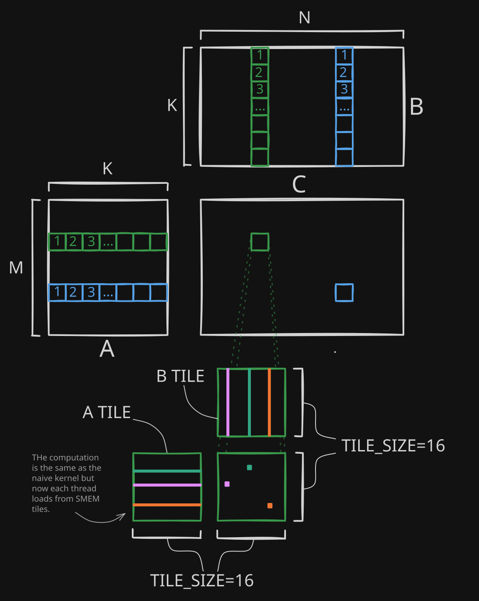
    <br>
</div>


In order to compute the final green output tile, the matmul between the green A1 and B1 tiles must be added with the matmuls of each iterations A and B tiles that follow it. There can be any amount

### Tiled Kernel:
```c++
__global__ void gemm_tiled_kernel(const float* A, const float* B, float* C, int M, int N, int K) {
    int tid = threadIdx.x;
    int bid = blockIdx.x;
    int bdim = blockDim.x;
    
    __shared__ float tileA[TILE_SIZE * TILE_SIZE]; // allocate SMEM
    __shared__ float tileB[TILE_SIZE * TILE_SIZE]; 
    
    float accum = 0;
    
    int in_tile_m = tid / TILE_SIZE; // } same process as in naive but instead of 
    int in_tile_n = tid % TILE_SIZE; // } the whole matrix, its within the tile

    int num_blks_n = (N + TILE_SIZE - 1) / TILE_SIZE;
    int mt = bid / num_blks_n * TILE_SIZE; // } indices that are quantized to the tiles
    int nt = bid % num_blks_n * TILE_SIZE; // } 
    for (int kt = 0; kt < K; kt += TILE_SIZE) { 
        // boundary checking
        bool maskA = mt + in_tile_m < M && kt + tid % TILE_SIZE < K;
        bool maskB = kt + tid / TILE_SIZE < K && nt + in_tile_n < N;
        
        // loading from GMEM -> SMEM, if boundary check fails fill with 0
        tileA[tid] = maskA ? A[(mt + in_tile_m) * K + (kt + tid % TILE_SIZE)] : 0; 
        tileB[tid] = maskB ? B[(kt + tid / TILE_SIZE) * N + (nt + in_tile_n)] : 0;
        

        __syncthreads();
        
        // compute dot product for assigned output element
        for (int k = 0; k < TILE_SIZE; k++) {
            accum += tileA[in_tile_m * TILE_SIZE + k] * tileB[k * TILE_SIZE + in_tile_n];
        }
        __syncthreads(); // forgetting this creates a race condition

    }
    // write result from registers -> GMEM
    C[(mt + in_tile_m) * N + (nt + in_tile_n)] = accum;
}
```
Notice that we dont store the output tiles in SMEM. For usage in ML applications we would normally have to store the output into SMEM and then do another element-wise operation, usually an activation function. Since we aren't implementing that, the outputs are written straight from registers to GMEM. 

`__syncthreads()` is a function included in CUDA that synchronizes threads in a block. Essentially, it acts as a barrier that prevents threads from working ahead until all threads from the same block catch up to that point in the code. We need the first sync to ensure that we arent computing the dot product using data that has not finished loading. The second sync is necessary because we dont want some threads to start replacing the SMEM tiles while other threads are still computing the dot product using said tiles. Neglecting to include these will create race conditions.

%maybe add note on debugging race conditions here%


%tiled speed here%

## Register Blocked
The main optimization in this kernel is called register blocking. The idea behind register blocking is that instead of having one thread be responsible for one output element, one thread will be responsible for a tile of output elements. It may seem counterintuitive that we are reducing parallelism to get more performance out of our kernel, but its more clear when you think of it as adding another layer of reuse and tiling that is one level up on the memory hierarchy.

Another change that we make in this kernel is that we update the input tile shape from a 16x16 square to a 128x8 tile for the A input tile, and a 8x128 tile for B. The size 8 in both tiles represents each tiles K dimension, and the size 128 is the M dimension for A and the N dimension for B. We are using a small K dimension and a larger M & N dimension because it lets us do more computation per input element loaded and also drastically increases the size of the output tile from 16x16 to 128x128. We went from 8192 FLOPs (Float Operations, 1 add or mul = 1 FLOP) per 2048 bytes loaded or 4 FLOPs/byte to 262144 FLOPs per 8192 bytes or 32 FLOPs/byte. The larger output tile also lets us go from 1 element per thread to 64 elements per thread. 

<div align="center">
    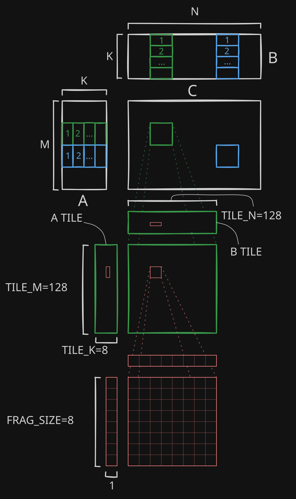
    <br>
</div>

The code to produce this tiling strategy:
```cpp
constexpr int WARP_SIZE = 32; // constant for all nvidia gpus
constexpr int BDIM = 256;
constexpr int WARPS_PER_BLOCK = BDIM / WARP_SIZE;

constexpr int TILE_M = 128; // block sizes along each dimension
constexpr int TILE_N = TILE_M; 
constexpr int TILE_K = 8; // small K and larger M and N boosts arithmetic intensity
constexpr int FRAG_SIZE = 8; // size of a input fragment that will loaded into registers

constexpr int T_PER_ROW = TILE_N / FRAG_SIZE;


__global__ void gemm_register_blocked_kernel(const float* A, const float* B, float* C, int M, int N, int K) {
    int bid = blockIdx.x;
    int tid = threadIdx.x;
    
    __shared__ float tileA[TILE_M * TILE_K]; // 128 x 8
    __shared__ float tileB[TILE_K * TILE_N]; // 8 x 128

    
    float output[FRAG_SIZE][FRAG_SIZE] = {0}; // preallocate our output tile on to registers
    
    int num_blks_n = (N + TILE_N - 1) / TILE_N; 
    int mt = bid / num_blks_n * TILE_M; // m tile idx
    int nt = bid % num_blks_n * TILE_N; // n tile idx

    
    for (int kt = 0; kt < K; kt += TILE_K) {
        // Load from GMEM to SMEM
        // Since we are now loading 4 elements per thread, (TILE_M * TILE_K / BDIM = 8 x 128 / 256 = 4)
        // we need a loop to load elements. The elements loaded are strided pattern, tid 0's values 
        // correspond to (0,0), (0,32), (0,64), (0,96) in the size (8,128) tileA
        #pragma unroll 
        for (int i = 0; i < TILE_K * TILE_M / BDIM; i++) { // since TILE_M = TILE_N both tiles can be loaded in the same loop
            int idx = tid + i * BDIM;
            bool maskA = mt + idx / TILE_K < M && kt + idx % TILE_K < K; 
            bool maskB = kt + idx / TILE_N < K && nt + idx % TILE_N < N; 
            tileA[idx] = maskA ? A[(mt + idx / TILE_K) * K + (kt + idx % TILE_K)] : 0; // (m index) * K + (k index)
            tileB[idx] = maskB ? B[(kt + idx / TILE_N) * N + (nt + idx % TILE_N)] : 0;
        }
        
        __syncthreads();
        
        // we unroll loops where 
        #pragma unroll 
        for (int k = 0; k < TILE_K; k++) {
            float fragA[FRAG_SIZE]; // allocate our 8x1 input fragments to registers
            float fragB[FRAG_SIZE];

            // Load from SMEM to registers
            #pragma unroll
            for (int i = 0; i < FRAG_SIZE; i++) {
                int in_tile_m = tid / T_PER_ROW * FRAG_SIZE; // same address calculation strategy from the previous kernels
                int in_tile_n = tid % T_PER_ROW * FRAG_SIZE;
                fragA[i] = tileA[(in_tile_m + i) * TILE_K + (k)];
                fragB[i] = tileB[(k) * TILE_N + (in_tile_n + i)];
            }

            // compute outer product (matmul of our two vector fragments)
            #pragma unroll
            for (int m = 0; m < FRAG_SIZE; m++) {
                #pragma unroll
                for (int n = 0; n < FRAG_SIZE; n++) {
                    output[m][n] += fragA[m] * fragB[n];
                }
            }
            
        }
        __syncthreads(); 

    }
    // write output to GMEM, this is uncoalesced atm
    #pragma unroll
    for (int m = 0; m < FRAG_SIZE; m++) {
        #pragma unroll
        for (int n = 0; n < FRAG_SIZE; n++) {
            int in_tile_m = tid / T_PER_ROW * FRAG_SIZE;
            int in_tile_n = tid % T_PER_ROW * FRAG_SIZE;
            C[(mt + in_tile_m + m) * N + (nt + in_tile_n + n)] = output[m][n];
        }
    }
}
```

## Warp Tiling
The main optimization in this kernel is warptiling. When threads are executing instructions in a nvidia gpu they execute synchronously in groups of 32 threads called warps*. Blocks are partitioned where thread ids 0-31 is one warp, 32-63 is another and so on until the block size. When indexing within a warp, the threads comprising the warp are referred to as lanes. If you are familiar with SIMD instructions, warps are quite similar. One warp runs one instruction across all 32 lanes with each thread running the instruction on its portion of the work. In well written kernels, nearly every single instruction behaves like this.  
<sub>*other gpu manufacturers have the same structure under different naming</sub>

<div align="center">
    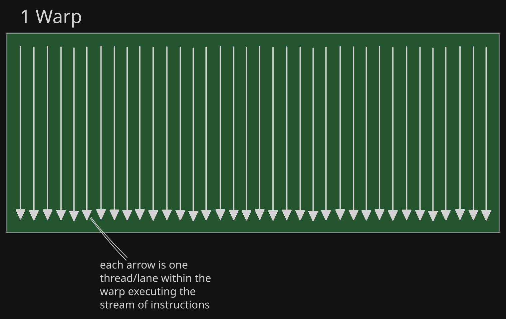
    <br>
</div>

The only time that all 32 threads aren't all executing the same instruction is when the warp encounters a branch instruction where the threads within a warp are split across half one path and half another path. When this happens the warp will execute both paths sequentially. This is called warp divergence. It does both paths sequentially by masking out the threads that aren't on the current path and executes and then repeating using the opposite mask and switching paths. 

<div align="center">
    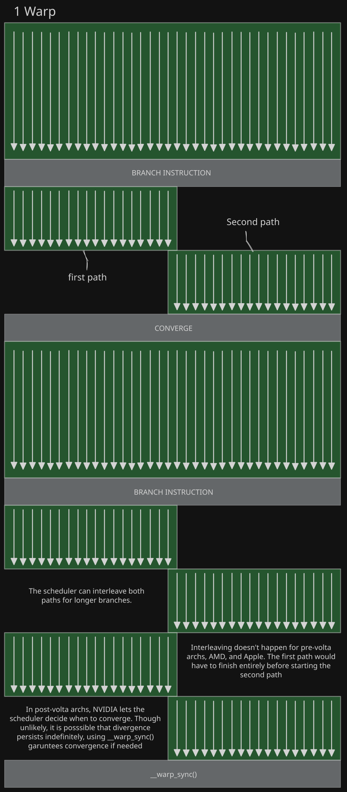
    <br>
</div>

So we want to minimize warp divergence because it reduces our throughput. To minimize warp divergence we have to weary of how conditionals like if statements are used in our code. Loops can also be problematic if the number of loop iterations vary per thread (e.g. in a case like Newton-Raphson square root where each thread iterates until individual convergence), but for our kernel we have nothing to worry about since our iterations are uniform across threads. 

In the register-blocked code we created a boolean mask and fed that into the ternary conditional operator ( ? : ) to determine whether to load the value or fill with 0 if out of bounds.

```c++
bool maskA = mt + idx / TILE_K < M && kt + idx % TILE_K < K; 
// bool maskB = kt + idx / TILE_N < K && nt + idx % TILE_N < N; 
tileA[idx] = maskA ? A[(mt + idx / TILE_K) * K + (kt + idx % TILE_K)] : 0; // (m index) * K + (k index)
// tileB[idx] = maskB ? B[(kt + idx / TILE_N) * N + (nt + idx % TILE_N)] : 0;
```
That code gets compiled into this PTX (intermediate assembly for nvidia gpus):
```c
$L__BB0_3:
	mov.f32 	%f986, 0f00000000;   // }
	add.s32 	%r29, %r5, %r121;    // }
	setp.ge.s32 	%p2, %r29, %r40; // } compute mask A
	setp.ge.s32 	%p3, %r4, %r38;  // } 
	// add.s32 	%r30, %r6, %r121; // mask B   
	or.pred  	%p4, %p3, %p2;       // }
	@%p4 bra 	$L__BB0_5;           // ] // skips to BB0_5 with %f986 set to 0 if predicate is oob
	add.s32 	%r100, %r29, %r8;    // ]
	mul.wide.s32 	%rd6, %r100, 4;  // ] conditional load path for Tile A 
	add.s64 	%rd7, %rd2, %rd6;    // ] (we want this path to be small)
	ld.global.f32 	%f986, [%rd7];   // ]
$L__BB0_5:
	st.shared.f32 	[%r9], %f986;    // can easily converge here
``` 
%% SASS compiles this into predicates

Notice that the compiled code does have a branch, but that the branch creates a single short path that quickly converges. Luckily, most of the warps that execute this instruction will not be on a boundary. It's not necessary to use the (? : ) op. Using a simple if statement also gets you the same result. Following this pattern of simple minimal branching ensures that warp divergence remains a non issue when writing.

Now that we've familiarized ourselves with how warps work and their main footgun, we can move onto warptiling. Warptiling is different from the previous tiling strategies because it does not exist at a separate level of the memory hierarchy and instead what its really doing is reordering the thread ids from being sequentially laid out in an SMEM tile to tiled by warp. This increases reuse because when threads within the same warp load the same address, the values will only be loaded once per warp and broadcasted across the warp for free. 

The full new tiling stategy: 
<div align="center">
    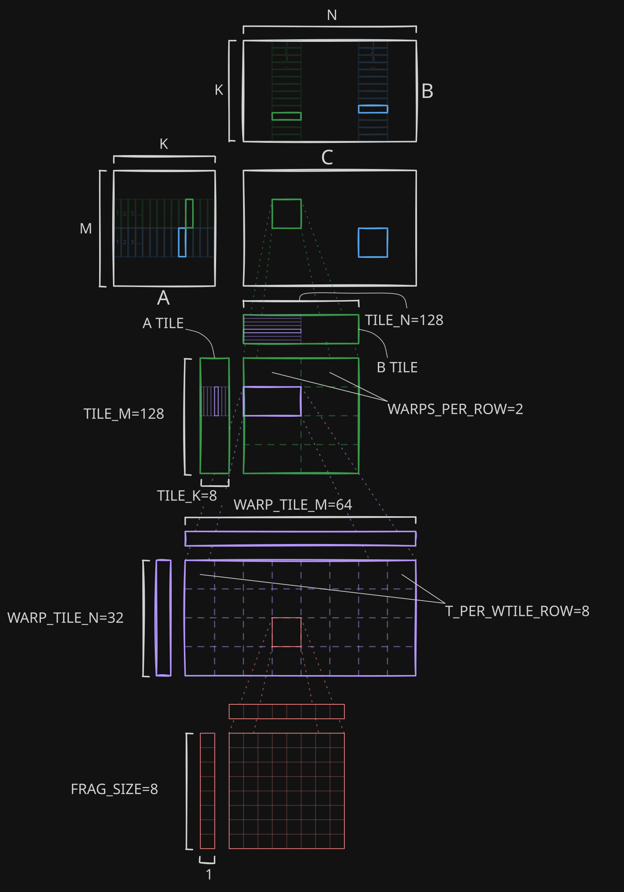
    <br>
</div>

<br>
</br>
Heres how thread ids are mapped within an SMEM output tile:

<div align="center">
    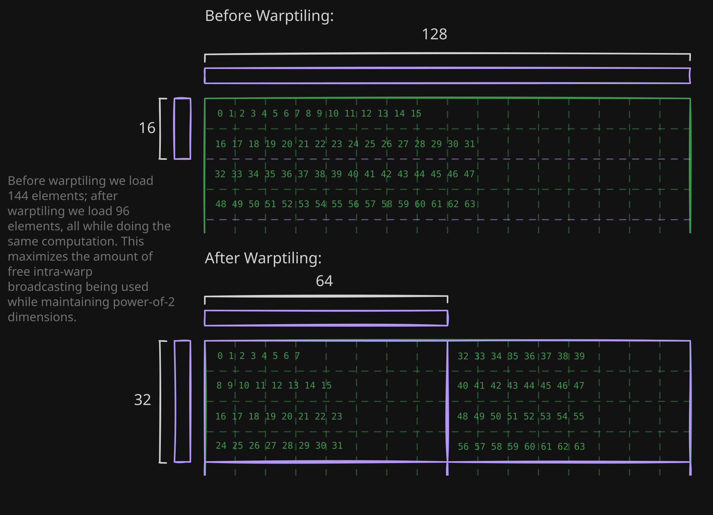
    <br>
</div>

The T_PER_WTILE_ROW and the WARPS_PER_ROW constants are needed for mapping thread/warp ids to the correct element index.

```cpp
constexpr int WARP_SIZE = 32; // constant for all nvidia gpus
constexpr int BDIM = 256;
constexpr int WARPS_PER_BLOCK = BDIM / WARP_SIZE;

constexpr int TILE_M = 128; // block sizes along each dimension
constexpr int TILE_N = TILE_M; 
constexpr int TILE_K = 8; // small K and larger M and N boosts arithmetic intensity
constexpr int FRAG_SIZE = 8;

// for laying out warps within a block
constexpr int WARP_PER_ROW = 2; // can be 2 or 4
constexpr int WARP_TILE_N = TILE_N / WARP_PER_ROW; // 128 / 2 = 64
constexpr int WARP_TILE_M = TILE_M / (BDIM / WARP_SIZE / WARP_PER_ROW); // (NUM_WARPS / WARPS_PER_ROW) is warps per col, // (256 / 32 / 2) = 4
constexpr int T_PER_WTILE_ROW = WARP_TILE_N / FRAG_SIZE;


__global__ void gemm_warptiled_kernel(const float* A, const float* B, float* C, int M, int N, int K) {
    int bid = blockIdx.x;
    int tid = threadIdx.x;
    int warp_id = tid / WARP_SIZE; // warp idx within a block, WARP_SIZE = 32 (universal across all nvidia gpus)
    int lane_id = tid % WARP_SIZE; // lane idx within a warp
    
    
    __shared__ float tileA[TILE_M * TILE_K]; // 128 x 8
    __shared__ float tileB[TILE_K * TILE_N]; // 8 x 128

    
    float output[FRAG_SIZE][FRAG_SIZE] = {0}; // preallocate our output tile on to registers
    
    int num_blks_n = (N + TILE_N - 1) / TILE_N; // number of blocks in the n dimension  
    int mt = bid / num_blks_n * TILE_M; // m tile idx
    int nt = bid % num_blks_n * TILE_N; // n tile idx
    for (int kt = 0; kt < K; kt += TILE_K) {
        // Load from GMEM to SMEM
        #pragma unroll
        for (int i = 0; i < TILE_M * TILE_K / BDIM; i++) { // since TILE_M = TILE_N both tiles can be loaded in a single loop
            int idx = tid + i * BDIM;
            bool maskA = mt + idx / TILE_K < M && kt + idx % TILE_K < K; 
            bool maskB = kt + idx / TILE_N < K && nt + idx % TILE_N < N; 
            tileA[idx] = maskA ? A[(mt + idx / TILE_K) * K + (kt + idx % TILE_K)] : 0; // (m index) * K + (k index)
            tileB[idx] = maskB ? B[(kt + idx / TILE_N) * N + (nt + idx % TILE_N)] : 0;
        }
        
        __syncthreads();
        
        #pragma unroll
        for (int k = 0; k < TILE_K; k++) {
            float fragA[FRAG_SIZE];
            float fragB[FRAG_SIZE];

            // Load from SMEM to registers
            #pragma unroll
            for (int i = 0; i < FRAG_SIZE; i++) {
                // prev: int in_tile_m = tid / T_PER_WTILE_ROW * FRAG_SIZE;
                int in_tile_m = warp_id / WARP_PER_ROW * WARP_TILE_M + lane_id / T_PER_WTILE_ROW * FRAG_SIZE;
                int in_tile_n = warp_id % WARP_PER_ROW * WARP_TILE_N + lane_id % T_PER_WTILE_ROW * FRAG_SIZE;
                fragA[i] = tileA[(in_tile_m + i) * TILE_K + (k)];
                fragB[i] = tileB[(k) * TILE_N + (in_tile_n + i)];
            }

            // compute outer product (matmul of our two vector fragments)
            #pragma unroll
            for (int m = 0; m < FRAG_SIZE; m++) {
                #pragma unroll
                for (int n = 0; n < FRAG_SIZE; n++) {
                    output[m][n] += fragA[m] * fragB[n];
                }
            }
            
        }
        __syncthreads(); 

    }
    // write output to GMEM, this is uncoalesced atm
    #pragma unroll
    for (int m = 0; m < FRAG_SIZE; m++) {
        #pragma unroll
        for (int n = 0; n < FRAG_SIZE; n++) {
            int in_tile_m = warp_id / WARP_PER_ROW * WARP_TILE_M + lane_id / T_PER_WTILE_ROW * FRAG_SIZE;
            int in_tile_n = warp_id % WARP_PER_ROW * WARP_TILE_N + lane_id % T_PER_WTILE_ROW * FRAG_SIZE;
            C[(mt + in_tile_m + m) * N + (nt + in_tile_n + n)] = output[m][n];
        }
    }
}
```


% TODO: retest and benchmark all kernels


## Vectorized
Looking back at the PTX the compiler generated for the previous kernel, the load/store instructions that the compiler emitted are `ld.global.f32` and `st.shared.f32`. Although by default the compiler will emit these 32-bit load/stores, the gpu can also do 64-bit or 128-bit contiguous load/stores. For our 32-bit floats that means we can load/store either 2 or 4 elements with a single vectorized instruction. This is helpful because if issuing ld/st instructions is throttling our kernel, we can use vectorized instructions to alleviate that bottleneck.

%% INSERT DIAGRAM FOR VECTORIZED HERE %%%

If we want to make the most of the available GMEM bandwidth, we can use a coalesced memory access pattern. An access pattern is usually considered coalesced when adjacent threads from the same warp access adjacent contiguous data in a single instruction. This was necessary on extremely old gpus (GT80/GT200) because the hardware had a unit that would merge memory transactions from multiple threads only if the adjacent threads accessed adjacent data. On modern gpus, data is accessed in 128 byte cache lines*. To get the maximum bandwidth usage, all of the threads collectively have to access all of the values in all of the loaded cache line(s) in a single instruction. The thread ordering doesn't matter, as long as the entire cache line is used in a single instruction we get the max bandwidth. 

<div align="center">
    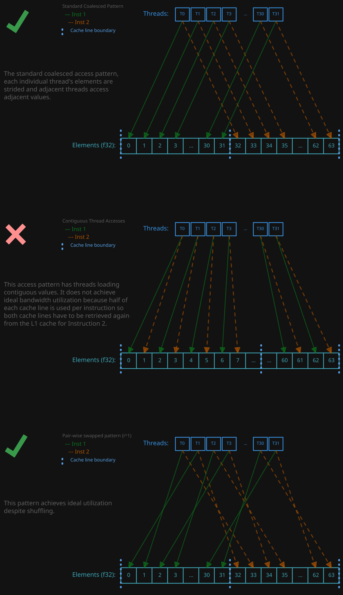
    <br>
</div>

If you went back to the previous kernels you would notice that the access pattern used from the start was already the standard coalesced pattern. This holds for even the naive kernel. However, if you are paying extremely close attention you may have realized that there is one operation where we do have threads trying to access contiguous values. Looking back at the store for the register blocked and warptiled kernels.

Register blocked store excerpt:
```cpp
#pragma unroll
for (int m = 0; m < FRAG_SIZE; m++) {
    #pragma unroll
    for (int n = 0; n < FRAG_SIZE; n++) {
        int in_tile_m = tid / T_PER_ROW * FRAG_SIZE;
        int in_tile_n = tid % T_PER_ROW * FRAG_SIZE;
        C[(mt + in_tile_m + m) * N + (nt + in_tile_n + n)] = output[m][n];
    }
}
```

Looking at the address calculation, the first term, `(mt + in_tile_m + m) * N`, is strided so we dont have to worry about that. The contiguous second term, `(nt + in_tile_n + n)`, where n is the value that varies across loop iterations shows us that we are storing FRAG_SIZE=8 values contiguously per thread. This access pattern is exactly the pattern we want to avoid.

Visually our access pattern looks like this: 
<div align="center">
    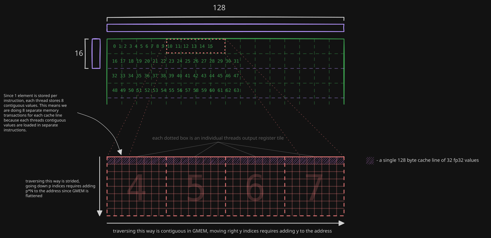
    <br>
</div>

Before we make changes, we should review the Nsight Compute profile of the previous kernel to get a baseline understanding. Looking at the Warp State Statistics section of the warptiled kernel's profile, we can see the distribution of what the warps are doing during a typical clock cycle.

<div align="center">
    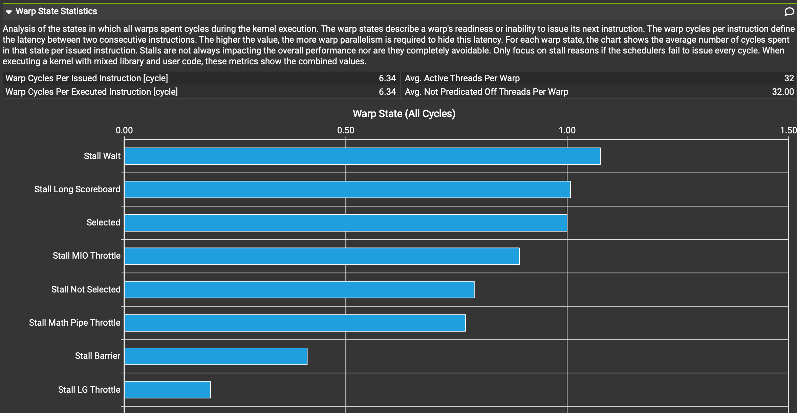
    <br>
</div>

For a kernel thats trying to be compute bound, the three good types of states are Stall Math Pipe Throttle (this increases as we get more compute bound), Selected (this means the sampled warp was executing an instruction), and Not Selected (the scheduler chose a different warp to run). Ideally, we minimize every other warp state. 

For this kernel we will be focusing mainly on reducing MIO throttle stalls. MIO throttle stalls occur when theres too many memory operations waiting to be dispatched in the hardware queue. The warp stalls until a slot frees up in the queue. Vectorization is perfect for this since it lets us load the same amount of data with fewer memory operations. So if we do 128 bit load/stores instead of the standard 32 bit ones, we would do 1/4 the amount of memory operations for the same amount of data transferred meaning that the queue will be full less often. 

There are two main approaches to implementing vectorization in cuda. We can either write in the vectorized ptx as inline assembly or we can use a packed dtype like float4 or int4 where 4 float32s/int32s are stored in one variable. We'll stick with float4s since we are using float32s. Inline ptx loads are more commonly used for lower precision data types.

Here's a sample line for loading from the vectorized kernel:
```cpp
// __shared__ float tileA[TILE_M * TILE_K]; <-- tileA instantiation for context
*(float4*)&tileA[idx] = maskA ? __ldcg((float4*)&A[(mt + idx / TILE_K) * K + (kt + idx % TILE_K)]) : zero; // (m index) * K + (k index)
```
`*(float4*)&`† before the `tileA` and `A` arrays effectively reinterpret casts the float array into a float4 array while letting us keep standard float indexing*. The `__ldcg()` load function is a function built into CUDA which when compiled turns into this PTX instruction `ld.global.cg.v4.f32`. The `.cg` part is the cache hint that the intrinsic function adds.

†syntactically we are taking the pointer of the value at the given index, `&`, and then casting that pointer to float4, `(float4*)`,  and finally we dereference `*`

*float4 requires you to divide indices by 4 before accessing
## Double Buffered


## Transposed


## Swizzled
