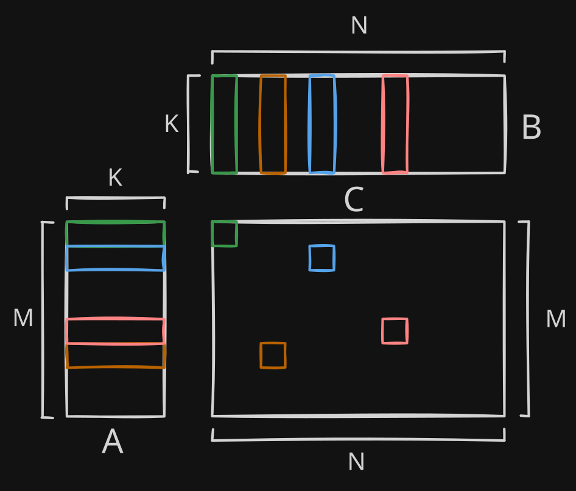

# GEMM to SoL

GEMM (General Matrix Multiply) to SoL (Speed of Light) are a collection of matrix multiplication kernels that build up optimizations upon each other to get as close as possible to the theoretical speed limit of matrix multiplication on gpus, the "speed of light." This project will be targeting SGEMM (fp32 GEMM) on a T4 gpu because it will help to build a strong foundation before moving on to modern features. The end result should be a kernel that is compute bound.

## Naive Implementation

The most basic GEMM implementation is three nested for loops:

```C++
for(int m = 0; m < M; m++) {     // } these loops get parallelized in the kernel
    for(int n = 0; n < N; n++) { // }
        for(int k = 0; k < K; k++) {
            C[m][n] += A[m][k] * B[k][n];
        }
    }
}
```

Using input matrices A (dims: M,K) and B (dims: K,N) we can create an output matrix C (dims: M,N) where each C output element (m,n) we compute the dot product along the shared k dimension of matrices A and B.

<!--  -->

<div align="center">
    
    <br>

</div>

To find the colored output element in the C matrix, we have to compute the dot product between the matching vectors from the A and B matrices. M, N, and K can be any size.

### Naive kernel implementation:

```C++
__global__ void gemm_naive_kernel(const float* A, const float* B, float* C, int M, int N, int K) {
    int tid = blockIdx.x * blockDim.x + threadIdx.x; // global thread id

    if (tid >= M * N) { // boundary check
        return;
    }

    // For a row major matrix which is size MxN, element (row, col) is at
    // a true array index of: row * N + col. The end result is an array in
    // which the rows of the matrix are laid out one after another. 
    // In this array, to move up to the next col idx we add 1 and to 
    // move to the next row idx we add N.
    // 
    // We have to do this because we need the row and col indices separately for 
    // accessing the correct elements in the A & B input matrices.
    // To do the opposite conversion using / and % with the row width (N)
    // to create row and col indices.
    int m = tid / N; // row 
    int n = tid % N; // col
    
    float accum = 0;
    for (int k = 0; k < K; k++) {
        // compute dot product by iterating along k
        accum += A[m * K + k] * B[k * N + n]; 
    }
    // write back result
    C[tid] = accum; // equivalent to C[m * N + n] 
}
```

In our naive implementation kernel we parallelize the outer two loops iterating over the M and N dimensions. This means that we have one working thread computing the entire dot product for one output element. If we were to also parallelize the K dimension it would be called a split-k GEMM. Typically we avoid split-k GEMM unless we have a large K dimension because we would have to combine outputs across threads which creates unnecessary complexity and overhead.

We also have a thread local sum variable which keeps the sum in a register until the computation is finished rather than writing to global memory (GMEM) each iteration.

### Kernel Launch Code:

```C++
torch::Tensor gemm_naive(torch::Tensor A, torch::Tensor B) {
    auto t = prep_tensors(A, B); // creates output tensor, checks dtype, contiguity, gets pointers, and gets M, N, K

    dim3 block(16, 16);
    dim3 grid((t.M + block.x - 1) / block.x, (t.N + block.y - 1) / block.y); // (a + b - 1) / b is the ceiling division operation where instead of having a remainder, we round up to the nearest multiple of b

    gemm_naive_kernel<<<grid, block>>>(t.A, t.B, t.C, t.M, t.N, t.K);
    cudaDeviceSynchronize();
    
    return t.C_tensor;

}
```

This our Kernel Launch code, it won't change much throughout the series. The main things to note are that we have chosen to have thread blocks that are 16x16 (256) threads large and that we are doing ceiling division so that we pad with extra threads in case our matrices have a dimension that is not divisible by block size. It is important that we keep our parameters either powers of 2 or multiples of high powers of 2 even if it means having wasted threads because a lot of the hardware parameters are also powers of 2 and having hardware alignment boosts performance.

% NAIVE SPEED HERE %


## Tiled

The first optimization we will make is switching from threads privately loading one element at a time from GMEM to having each block of threads cooperatively load shared tiles of input elements together into shared memory (SMEM). Threads get elements faster because the values are being accessed from SMEM (\~30 cycles) and redundant accesses to GMEM (\~400-800 cycles) and L2 cache (\~200-400 cycles) are avoided.

When we load our tiles, some loaded tiles may be partially out of bounds of our A or B matrices. To resolve this, we run a bounds check before loading and if it fails we fill in a 0. As mentioned earlier, maintaining hardware alignment is far more important for performance than having some extra elements and unnecessary work.


<div align="center">
    
    <br>
</div>


In order to compute the final green output tile, the matmul between the green A1 and B1 tiles must be added with the matmuls of each iterations A and B tiles that follow it.

### Tiled Kernel:
```C++
__global__ void gemm_tiled_kernel(const float* A, const float* B, float* C, int M, int N, int K) {
    int tid = threadIdx.x;
    int bid = blockIdx.x;
    int bdim = blockDim.x;
    
    __shared__ float tileA[TILE_SIZE * TILE_SIZE]; // allocate SMEM
    __shared__ float tileB[TILE_SIZE * TILE_SIZE]; 
    
    float accum = 0;
    
    int in_tile_m = tid / TILE_SIZE; // } same process as in naive but instead of 
    int in_tile_n = tid % TILE_SIZE; // } the whole matrix, its within the tile

    int num_blks_n = (N + TILE_SIZE - 1) / TILE_SIZE;
    int mt = bid / num_blks_n * TILE_SIZE; // } this time we want our indices quantized to the tiles
    int nt = bid % num_blks_n * TILE_SIZE; // } 
    for (int kt = 0; kt < K; kt += TILE_SIZE) { 
        // boundary checking
        bool maskA = mt + in_tile_m < M && kt + tid % TILE_SIZE < K;
        bool maskB = kt + tid / TILE_SIZE < K && nt + in_tile_n < N;
        
        // loading from GMEM -> SMEM, if boundary check fails fill with 0
        tileA[tid] = maskA ? A[(mt + in_tile_m) * K + (kt + tid % TILE_SIZE)] : 0; 
        tileB[tid] = maskB ? B[(kt + tid / TILE_SIZE) * N + (nt + in_tile_n)] : 0;
        

        __syncthreads();
        
        // compute dot product
        for (int k = 0; k < TILE_SIZE; k++) {
            accum += tileA[in_tile_m * TILE_SIZE + k] * tileB[k * TILE_SIZE + in_tile_n];
        }
        __syncthreads(); // forgetting this creates a race condition

    }
    // write result from registers -> GMEM
    C[(mt + in_tile_m) * N + (nt + in_tile_n)] = accum;
}
```
Notice that we dont store the output tiles in SMEM. For usage in ML applications we would normally have to store the output into SMEM and then do another element-wise operation, usually an activation function. Since we aren't implementing that, the outputs are written straight from registers to GMEM. 

`__syncthreads()` is a function included in CUDA (indicated by `__` prefix) that synchronizes threads in a block. Essentially, it acts as a barrier that prevents threads from doing work past it until all threads from the same block catch up to the sync function. We need the first sync to ensure that we arent computing the dot product using data that has not finished loading. The second sync is necessary because we dont want some threads to start replacing the SMEM tiles while other threads are still computing the dot product using said tiles. Neglecting to include these will create race conditions.

%maybe add note on debugging race conditions here%

%add reference to additional info about the CUDA memory hierarchy%

%maybe add bit about coalescing%

%tiled speed here%

## Register Blocked
The main optimization in this kernel is called register blocking. The idea behind register blocking is that instead of having one thread be responsible for one output element, one thread will be responsible for a tile of output elements. It may seem counterintuitive that we are reducing parallelism to get more performance out of our kernel, but its more clear when you think of it as adding another layer of reuse and tiling that is one level up on the memory hierarchy.

Another change that we make in this kernel is that we update the input tile shape from a 16x16 square to a 128x8 tile for the A input tile, and a 8x128 tile for B. The size 8 in both tiles represents each tiles K dimension, and the size 128 is the M dimension for A and the N dimension for B. We are using a small K dimension and a larger M & N dimension because it lets us do more computation per input element loaded and also drastically increases the size of the output tile from 16x16 to 128x128. We went from 8192 FLOPs (Float Operations, 1 add or mul = 1 FLOP) per 2048 bytes loaded or 4 FLOPs/byte to 262144 FLOPs per 8192 bytes or 32 FLOPs/byte. The larger output tile also lets us go from 1 element per thread to 64 elements per thread. 

<div align="center">
    
    <br>
</div>

## Warp Tiling
The main optimization in this kernel is warptiling. When threads are executing instructions in a nvidia gpu they execute synchronously in groups of 32 threads called warps*. Blocks are partitioned where thread ids 0-31 is one warp, 32-63 is another and so on until the block size. When identifying and indexing specifically within a warp, threads are often referred to as lanes. If you are familiar with SIMD instructions, warps are quite similar. One warp runs one instruction across all 32 lanes with each thread running the instruction on its portion of the work. In well written kernels, nearly every single instruction behaves like this.  
<sub>*other gpu manufacturers have the same structure under different naming</sub>

<div align="center">
    
    <br>
</div>

The only time that all 32 threads aren't all executing the same instruction is when the warp encounters a branch instruction where the threads within a warp are split across half one path and half another path. When this happens the warp will execute both paths sequentially. This is called warp divergence. It does both paths sequentially by masking out the threads that aren't on the current path and executes and then repeating using the opposite mask and switching paths. 

<div align="center">
    
    <br>
</div>

We really want to minimize warp divergence because it 

% TODO: retest and benchmark all kernels


## Vectorized


## Double Buffered


## Transposed


## Swizzled
